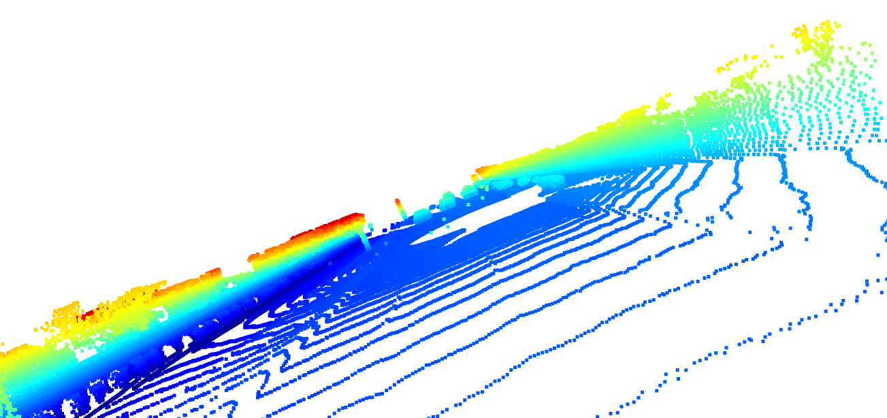

# udacity_mid_term_project_sensor_fusion

# The Point Cloud Sample:

| | |
|:---------------:|:---------------:|
| |  |
| |  |
| |  |
| |  |
| |  |

10 examples of vehicles with different angle are given above. The lidar point cloud shows the chassis of 
the vehicle. One can identify it easily. Some of the vehicle’s rear side like rear-bumper and tail-lights is 
also visible from behind. I think some trees of the street are also visible.

 
In the lidar intensity channel of the last vehicle is also displayed here. In that image, the rear bumper of 
a vehicle is clearly visible
